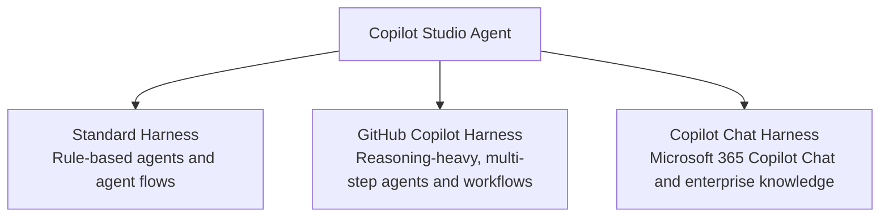

I recently completed the [Recruit Challenge from the Azure AI Community](https://microsoft.github.io/agent-academy/recruit/).

It had been sitting in my backlog for a while, so I decided to give it the attention—and closure—it deserved. I completed both the Copilot Studio Agent challenges and the GitHub Copilot Harness challenge.

The training corrected a misunderstanding I had from the beginning.

I assumed that a Standard Harness meant “Copilot Studio agents,” while a GitHub Copilot Harness meant “GitHub agents.”

That is not really the distinction.

The same Copilot Studio agent can work through different harnesses. What changes is the environment around the agent: where it runs, how people interact with it, how work is orchestrated, and what type of experience you are building.

If you already know Copilot Studio and are beginning to explore harnesses, this is the explanation I wish I had before I started.

---

## What Is a Harness?

A harness is the environment in which an agent executes.

That sounds small, but it changes a lot.

The harness affects:

- How users interact with an agent
- How work is triggered and orchestrated
- How much of a process can be automated end to end
- The kind of experience you can build around the agent
- How usage is measured and managed

So the question is not only, *“What agent am I building?”*

It is also, *“Where will this agent run, and what kind of work should it do there?”*

> 📌 **One thing worth remembering:** A harness does not replace good agent design. No matter where an agent runs, it still needs clear instructions, the right knowledge sources, useful tools, and testing with real user questions.

---

## The Building Blocks Still Matter

Before comparing harnesses, it helps to remember the building blocks that make an agent useful:

- **Instructions** — define the agent’s purpose, behavior, and tone.
- **Knowledge** — gives the agent grounded information to work with.
- **Tools** — let the agent take action or connect to other systems.
- **Topics** — help define guided conversation paths for specific scenarios.

These are the foundations. The harness determines the execution experience around them.

---

## The Three Harnesses I Encountered

| Harness | Primary context | My simple takeaway |
|---|---|---|
| **Standard Harness** | Copilot Studio and Power Platform | Best for predictable, process-driven work |
| **GitHub Copilot Harness** | A GitHub-oriented, AI-driven experience | Best for reasoning-heavy and more open-ended work |
| **Copilot Chat Harness** | Microsoft 365 Copilot Chat and enterprise knowledge | Best when the experience belongs in the Microsoft 365 context |

The agent can remain a Copilot Studio agent. The harness determines the surrounding execution experience.

---

## Standard Harness: The Familiar Starting Point

If you have already worked with Copilot Studio, the Standard Harness will feel familiar.

It builds on the Copilot Studio and Power Platform foundations many of us already know:

- Solutions
- Agents
- Topics
- Triggers
- Power Automate workflows
- Connectors
- Licensing and governance

This is the path I would start with when the business process is clear and follows a defined route.

For example, imagine an employee onboarding request:

1. A request is submitted.
2. Required information is collected.
3. The request moves through an approval path.
4. A workflow performs the next action.
5. The requester receives an update.

That does not mean the agent is less capable. It simply means the work benefits from structure, rules, and predictable outcomes.

> 💡 **My rule of thumb:** If a process has a fixed path, clear business rules, and expected outcomes, the Standard Harness is a natural place to start.

---

## GitHub Copilot Harness: More Than “GitHub Agents”

This was the biggest learning moment for me.

At first, I thought the GitHub Copilot Harness was simply a place to create GitHub agents. But it is better understood as a GitHub-oriented environment for Copilot Studio agent capabilities.

You can still create the things you would expect:

- Agents
- Workflows
- Topics
- Triggers
- Connections and tools

But the GitHub Copilot Harness adds a more AI-driven, goal-oriented approach to work.

Instead of defining every single step before the process starts, you can describe what you want to achieve. The agent and harness can then help determine how to make progress.

This is why I would consider it for work that is more reasoning-heavy, complex, or open-ended.

### Skills

One capability that stood out to me was **skills**.

In the GitHub Copilot Harness, you can upload your own skills as Markdown (`.md`) files. This creates a reusable way to provide guidance, instructions, and context for an agent.

I am not going deep into skills in this post because I think they deserve their own practical walkthrough. In a later post, I will create and upload a simple skill and share what I learn.

### Copilot Credits

Another important point is usage.

In the GitHub Copilot Harness, agents and workflows use Copilot Credits. Even a workflow trigger uses a Copilot Credit.

That is not a reason to avoid the harness. It is simply something to consider while designing a solution—especially when workflows may run often.

> ⚠️ **Validate usage details before production planning.** Copilot Credit and licensing rules evolve quickly. Treat this post as a learning guide, then verify the current documentation before making architecture or cost decisions.

---

## Copilot Chat Harness: Bringing Agents into Microsoft 365 Copilot Chat

The Copilot Chat Harness extends the Microsoft 365 Copilot Chat experience.

This is relevant when your agent needs to live in a familiar Microsoft 365 context and connect to enterprise knowledge.

If users already work in Microsoft 365 Copilot Chat and need an agent that can help them access organizational information, this harness gives you a natural place to meet them where they already work.

> 📌 **The important idea:** You are not choosing a different type of agent every time. You are choosing the experience and context in which your Copilot Studio agent will run.

---

## When Should You Choose Which Harness?

There is no universal winner here.

Both the Standard Harness and the GitHub Copilot Harness can support capable agents. The better choice depends on the shape of the work.

| If your work is… | Start by considering… | Why |
|---|---|---|
| Fixed, rule-based, and process-driven | **Standard Harness** | The path, triggers, and outcomes are already well defined |
| Reasoning-heavy, complex, or less predictable | **GitHub Copilot Harness** | The work benefits from more flexible, goal-oriented execution |
| Built around Microsoft 365 Copilot Chat and enterprise knowledge | **Copilot Chat Harness** | The experience belongs naturally in the Microsoft 365 environment |

My advice is not to treat these as strict boundaries.

The capabilities can overlap. But once you start building real examples, the design decision becomes much clearer. You begin to see when a structured workflow is enough—and when the problem genuinely needs more reasoning and flexibility.

---

## One Note Before You Start

Copilot Studio is evolving quickly. The Recruit learning material includes both classic and newer authoring experiences, so your screen may not always look exactly like the screenshots in a course or blog post.

The underlying concepts still matter: grounding, instructions, tools, topics, workflows, skills, testing, and deployment.

---

## What I Am Exploring Next

This post is intentionally the overview.

In the next posts, I plan to explore:

- Building a practical agent with the Standard Harness
- What is available in the Standard Harness
- A hands-on example of agents and workflows in the GitHub Copilot Harness
- How skills work and how to upload a Markdown skill
- Where Copilot Chat Harness fits into an enterprise knowledge experience

---

The biggest thing this challenge gave me was not just a badge.

It gave me a clearer mental model.

A harness is not another name for an agent. It is the execution environment that shapes how an agent works, how users experience it, and how much flexibility the solution has.

That distinction took me a little time to understand. I hope this post saves someone else that time.